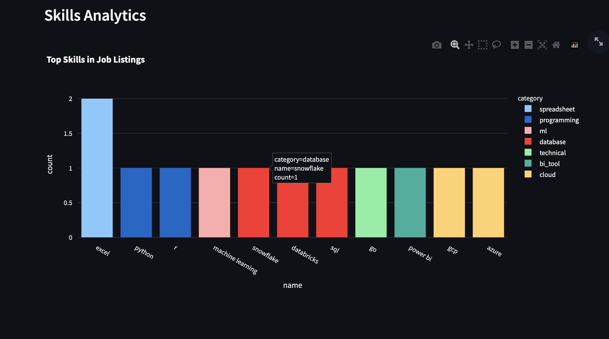
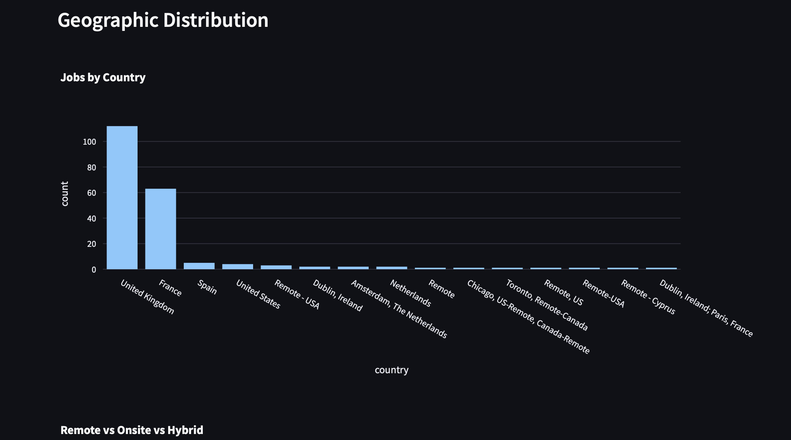

# Job Intelligence Platform

[](https://github.com/Akidima/job-intelligence-platform/actions/workflows/ci.yml)

AI-powered global job intelligence and portfolio recommendation platform that discovers entry-level analytics jobs, analyzes hiring trends, and recommends real-world projects.

_An end-to-end data pipeline that turns scattered job postings into actionable hiring intelligence._

`Python` · `async httpx` · `SQLAlchemy` · `PostgreSQL` · `Streamlit` · `Docker`

## Screenshots

**Skills demand dashboard**



**Job distribution by country**



## Quick Start

### 1. Clone and Install

```bash
git clone <repo-url>
cd job_portfolio
python -m venv .venv
source .venv/bin/activate
pip install -r requirements.txt
```

### 2. Setup Database

```bash
# Start PostgreSQL (Docker)
docker run -d --name postgres -p 5432:5432 \
  -e POSTGRES_USER=postgres \
  -e POSTGRES_PASSWORD=postgres \
  -e POSTGRES_DB=job_intelligence \
  postgres:16-alpine

# Or use Docker Compose
docker compose up -d db
```

### 3. Configure Environment

```bash
cp .env.example .env
# Edit .env with your database URL and optional API keys
```

### 4. Run Pipeline

```bash
python main.py
```

### 5. Launch Dashboard

```bash
streamlit run src/dashboard/app.py
```

## Docker Setup

```bash
# Start everything
docker compose up -d

# View logs
docker compose logs -f pipeline

# Stop
docker compose down
```

## Architecture

```
main.py (entry point)
  |
  +-- JobIntelligencePipeline
        |
        +-- JobDiscoveryEngine (scrapers)
        |     +-- RemoteOK, Remotive, Greenhouse, Lever
        |     +-- Ashby, SmartRecruiters, EU Startup, Adzuna
        |
        +-- JobParser (normalize data)
        +-- JobValidator (filter scams, check freshness)
        +-- SkillExtractor (NLP skill detection)
        +-- AnalyticsEngine (hiring trends)
        +-- RecommendationEngine (job matching + project recs)
        +-- ExportEngine (CSV, Excel, JSON, Markdown)
        +-- Database (PostgreSQL)
        +-- Dashboard (Streamlit)
```

## Project Structure

```
job_portfolio/
├── main.py                          # Entry point
├── requirements.txt                 # Python dependencies
├── docker-compose.yml               # Docker services
├── Dockerfile                       # Pipeline container
├── Dockerfile.dashboard             # Dashboard container
├── .env.example                     # Environment config
├── .github/workflows/pipeline.yml   # GitHub Actions CI/CD
├── src/
│   ├── config/settings.py           # App configuration
│   ├── scrapers/                    # Job source connectors
│   │   ├── base.py                  # Base scraper class
│   │   ├── remoteok.py             # RemoteOK API
│   │   ├── remotescraper.py        # Remotive API
│   │   ├── greenhouse.py           # Greenhouse API
│   │   ├── lever.py                # Lever API
│   │   ├── ashby.py                # Ashby API
│   │   ├── smartrecruiters.py      # SmartRecruiters API
│   │   ├── linkedin_rss.py         # LinkedIn public guest jobs API
│   │   ├── indeed.py               # Indeed scraping
│   │   ├── eu_startup.py           # EU Startup Jobs
│   │   ├── adzuna.py               # Adzuna API
│   │   ├── welcometothejungle.py   # Welcome to the Jungle (Algolia)
│   │   └── job_intelligence.py     # Discovery orchestrator
│   ├── parsers/job_parser.py       # Data normalization
│   ├── validators/job_validator.py  # Data validation
│   ├── skills/extractor.py         # NLP skill extraction
│   ├── storage/models.py           # SQLAlchemy models
│   ├── analytics/engine.py         # Trend analytics
│   ├── recommendations/engine.py   # AI matching engine
│   ├── exports/engine.py           # Report generation
│   ├── dashboard/app.py            # Streamlit dashboard
│   └── pipeline.py                 # Main orchestration
├── tests/test_pipeline.py          # Unit tests
├── scripts/scheduler.py            # 12-hour scheduler
├── data/                           # Data storage
│   ├── raw/
│   ├── processed/
│   ├── reports/
│   └── logs/
└── docs/
```

## Job Sources

| Source | Type | Notes |
|--------|------|-------|
| RemoteOK | API | Remote jobs worldwide |
| Remotive | API | Remote tech jobs |
| Greenhouse | API | 14+ company boards |
| Lever | API | 10+ company boards |
| Ashby | API | Startup job boards |
| SmartRecruiters | API | Enterprise job boards |
| LinkedIn | API | Public guest jobs API (entry-level + recency filtered) |
| Indeed | HTML | Public job listings |
| EU Startup Jobs | API | European startups |
| Adzuna | API | Multi-country (requires key) |
| Welcome to the Jungle | API | EU job board (best-effort; reliable with Algolia search key) |

## Role Categories

Discovery now spans three role categories, configurable in `src/config/settings.py`:

| Category | Example titles |
|----------|----------------|
| `analytics` | Data Analyst, Business Analyst, Analytics Engineer, Data Scientist |
| `business_development` | Business Development Analyst/Representative, SDR, Partnerships Analyst |
| `customer_service` | Customer Service/Support/Success, Customer Experience, Technical Support |

A job is kept when its title matches an enabled category (`enabled_role_categories`)
and it reads as entry-level. The matched category is recorded on each job. Query-driven
sources (LinkedIn, Adzuna, Remotive, Welcome to the Jungle) derive their search terms
from `role_category_queries`.

## Features

- **Job Discovery**: 50-100 jobs per run from 10+ sources
- **Skill Extraction**: NLP-based detection of 200+ technical and soft skills
- **Hiring Analytics**: Trends by country, industry, skill, and time
- **Job Matching**: AI-powered candidate-to-job matching with scores
- **Project Recommendations**: Real-world portfolio projects with datasets
- **Export Reports**: CSV, Excel, JSON, Markdown
- **Streamlit Dashboard**: Interactive analytics visualization
- **12-hour Scheduling**: Automated pipeline execution
- **Docker Deployment**: One-command setup

## Scheduler

Run the pipeline every 12 hours:

```bash
# Using the built-in scheduler
python scripts/scheduler.py

# Or using GitHub Actions (configured in .github/workflows/pipeline.yml)
# Automatically runs at 00:00 and 12:00 UTC
```

## API Keys (Optional)

| Service | Key | Purpose |
|---------|-----|---------|
| Adzuna | `ADZUNA_APP_ID`, `ADZUNA_APP_KEY` | Multi-country job search |
| Remotive | `REMOTIVE_API_KEY` | Enhanced API access |
| Welcome to the Jungle | `WTTJ_ALGOLIA_APP_ID`, `WTTJ_ALGOLIA_API_KEY` | Reliable WTTJ search via Algolia (public search-only key, copied from the site's network requests) |

## Dashboard

Access at `http://localhost:8501` after running:

```bash
streamlit run src/dashboard/app.py
```

Features:
- Interactive job listings with filters
- Skills demand charts
- Geographic distribution maps
- Execution history logs
- CSV download

## Testing

```bash
pytest tests/ -v
```

## License

MIT
